TASK 1: REPOSITORY SETUP
1. Creation of GitHub Repository:
- Logging in to my GitHub account.
- Create a new repository on GitHub (let's call it "PLPBasicGitAssignment").

- Initialize it with a README file:
 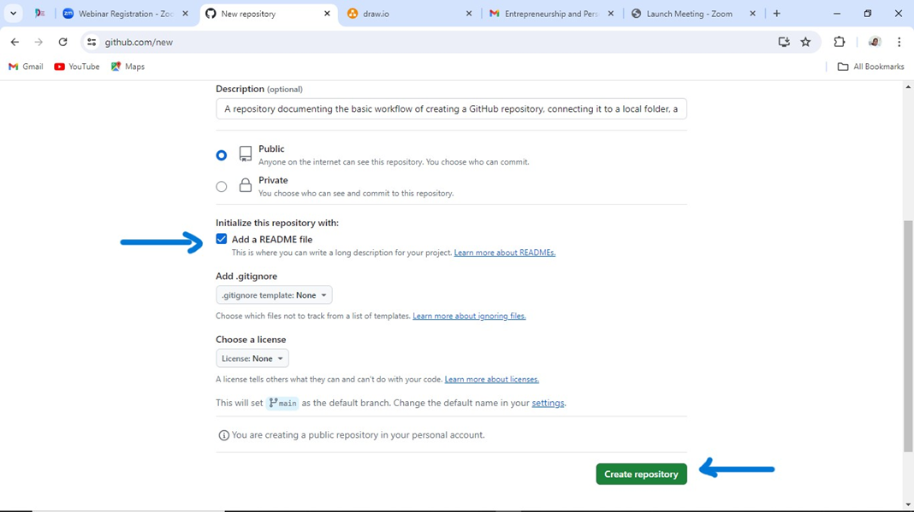
 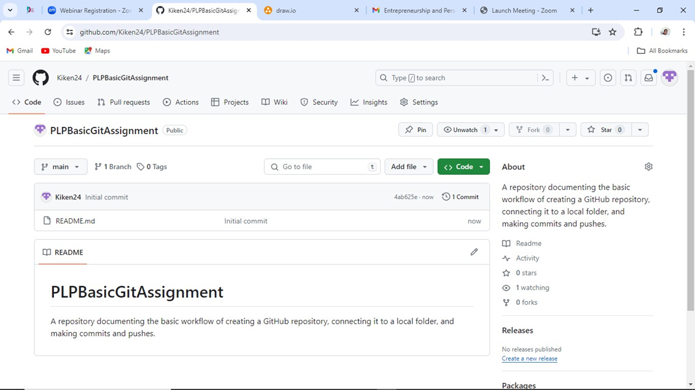

TASK 2: LOCAL SETUP
2. Local Folder Setup:
- Creating a local folder on my local machine:
 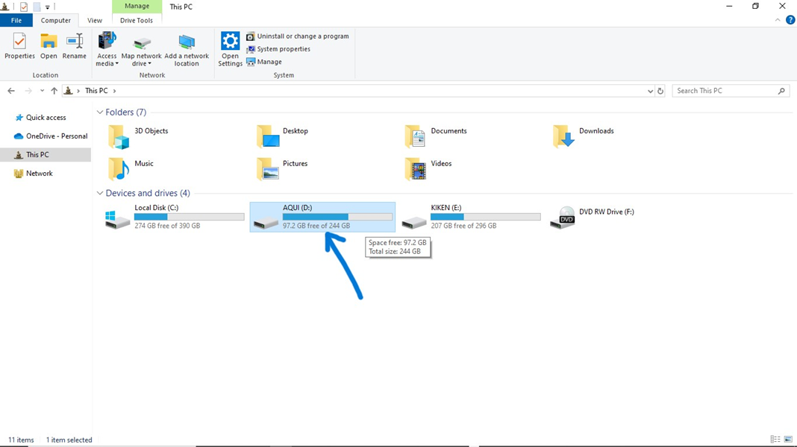
 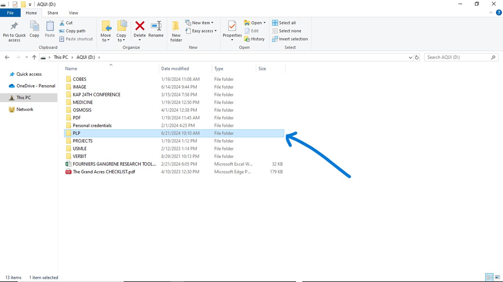
- I have named it "PLPBasicGitAssignment" as demonstrated below:
 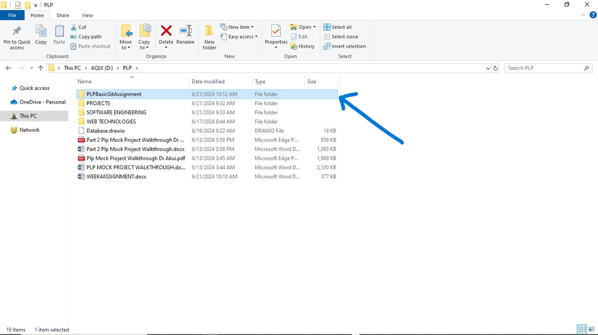
- Opening a terminal or command prompt and navigate to the created folder:
 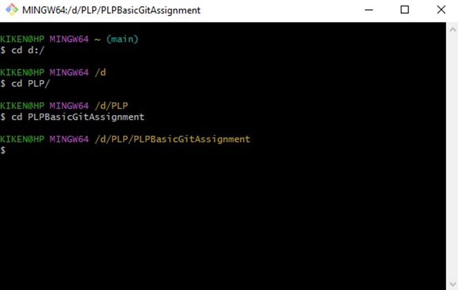
3. Git Initialization:
- Initialize a new Git repository in your local folder:
 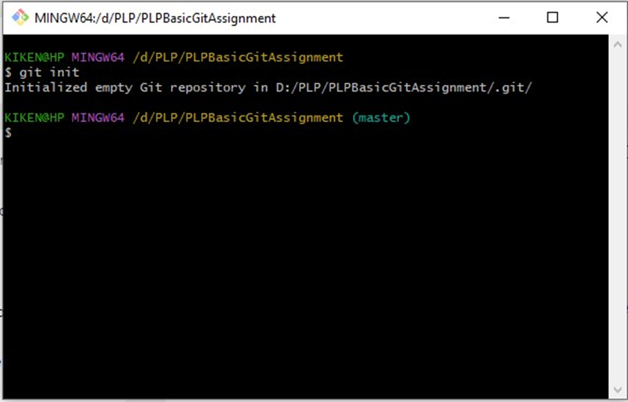
4. Connecting to GitHub:
- Copy the URL from GitHub repository as demonstrated below:
 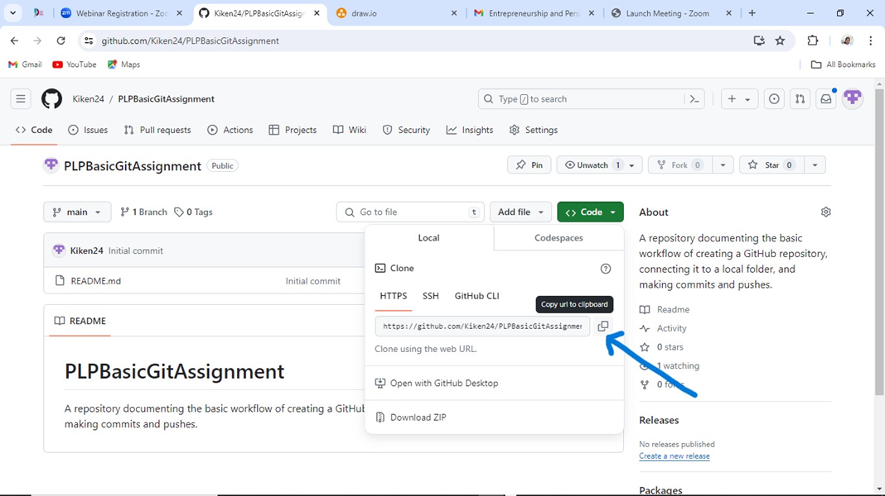
- Linking my local repository to the GitHub repository I created in Task 1 by typing on the Gitbash terminal the following command: 
git remote add origin https://github.com/Kiken24/PLPBasicGitAssignment.git
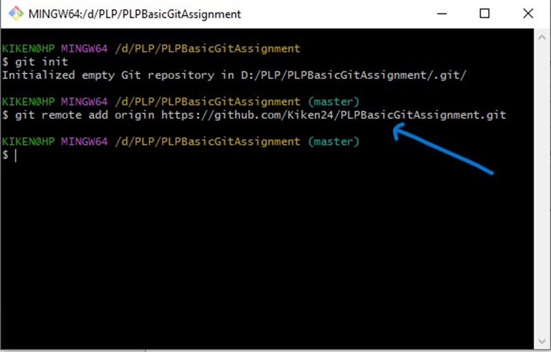
TASK 3: MAKING CHANGES
5. Create a File:
- Inside your local folder, create a new text file (e.g., `hello.txt`).
•	I created a new text file in my local folder through Gitbash terminal by typing the command: vi hello.txt
 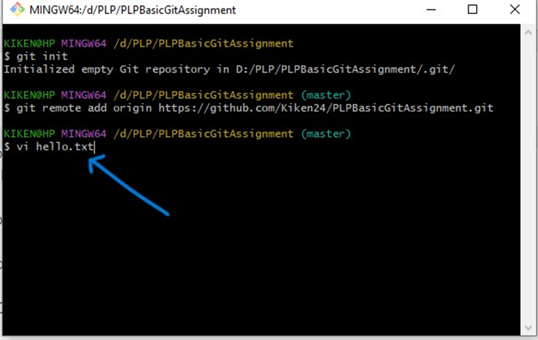
•	This prompted opening of vim where I added a simple text message.
- Add a simple text message (e.g., "Hello, Git!"):
•	After vim was opened I pressed I on my keyboard to allow me to insert text on the file for which I typed “Hello,Git!”
•	To close vim I pressed the following keyboard keys in succession escape, shift+colon, w, q then enter.
 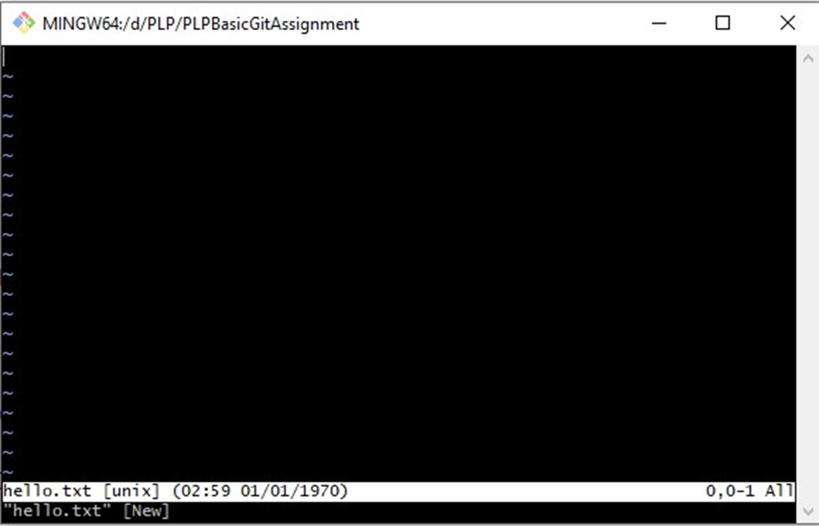
 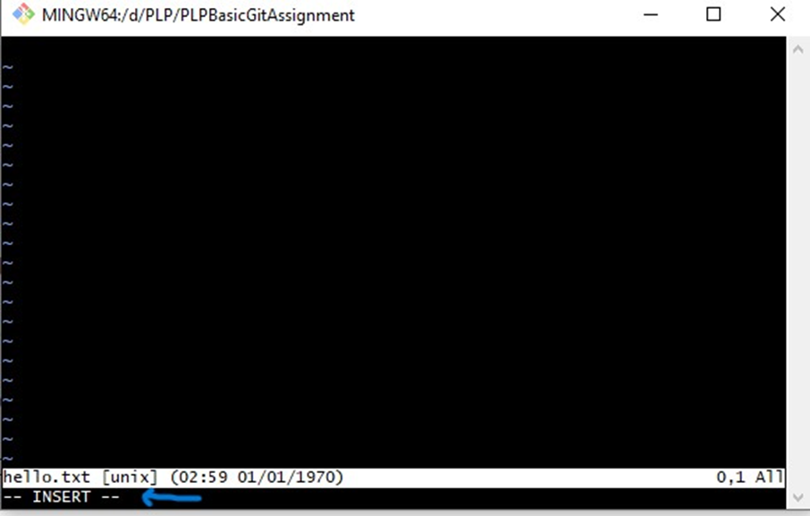
 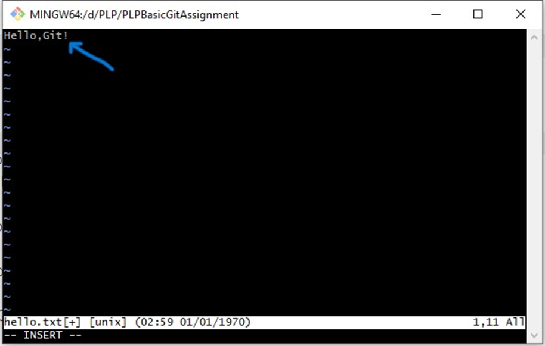
 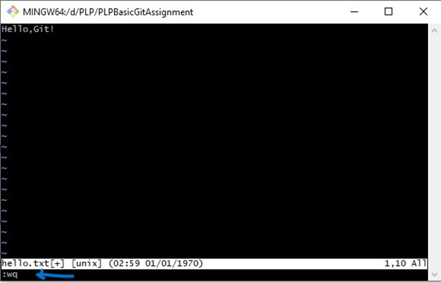
 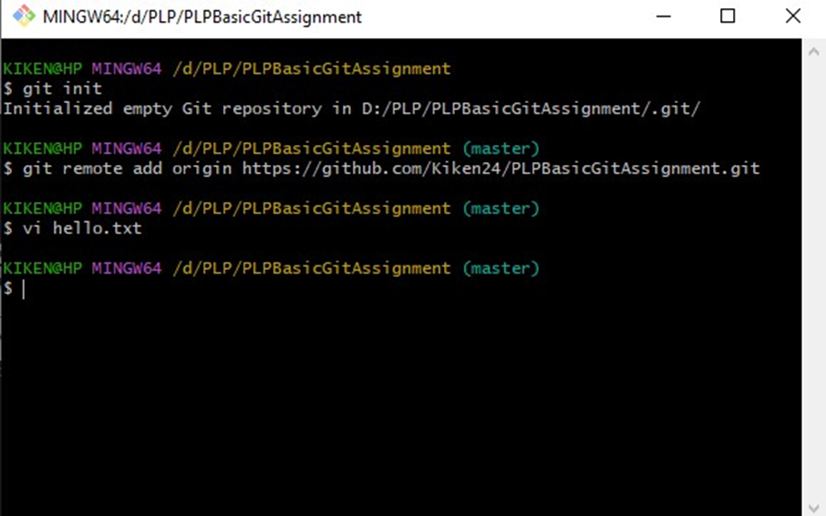
 
6. Committing Changes:
 - Stage the changes:
•	git add hello.txt
 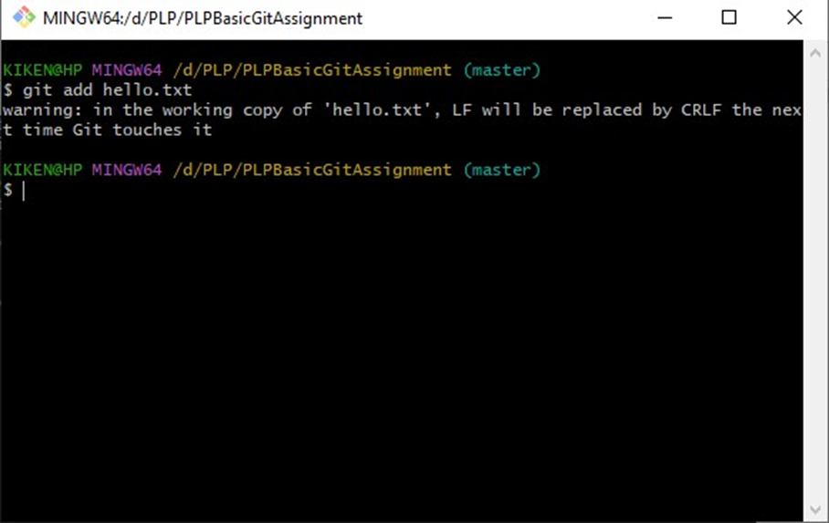
 - Commit the changes:
•	git commit -m "Add hello.txt with a greeting"
 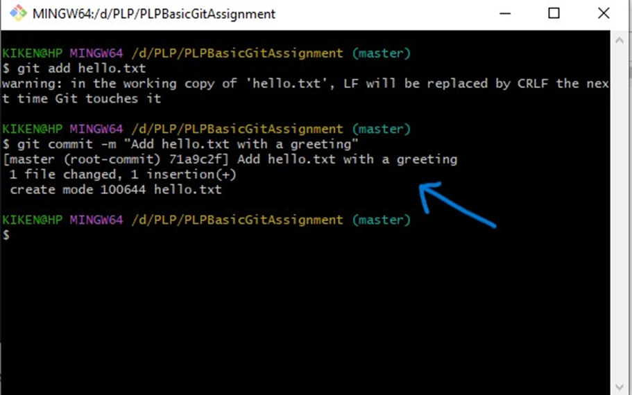
TASK 4: PUSHING TO GITHUB
7. Pushing to GitHub:
- Push the committed changes to your GitHub repository:
•	git push -u origin master
 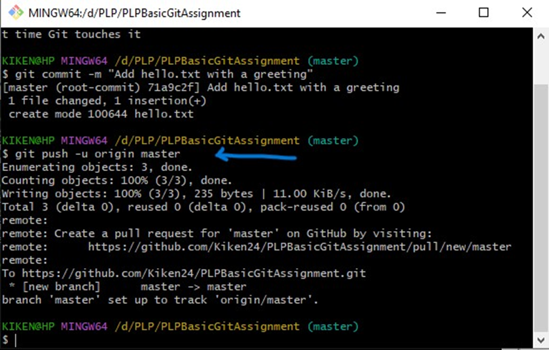
TASK 5: VERIFICATION
8. Verify on GitHub:
- Visit your GitHub repository in a web browser and confirm that the `hello.txt` file and commit message are visible.
 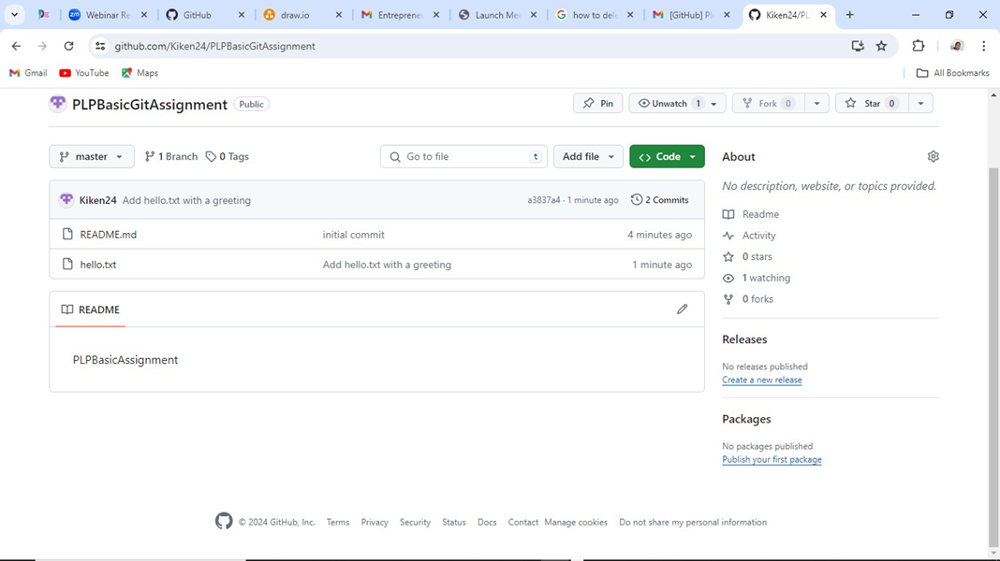

